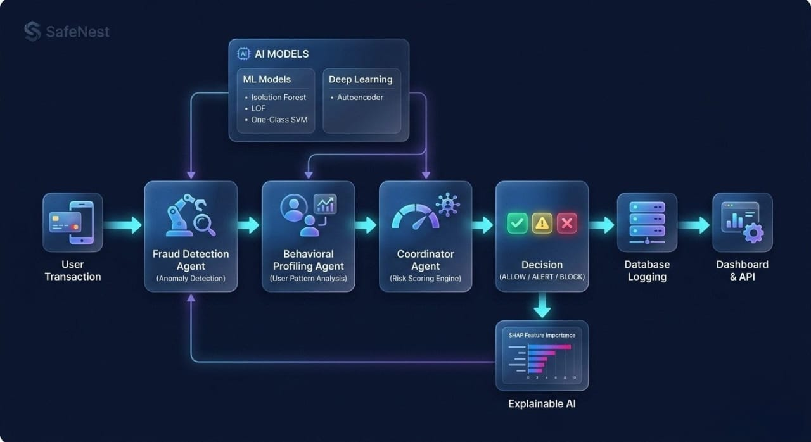
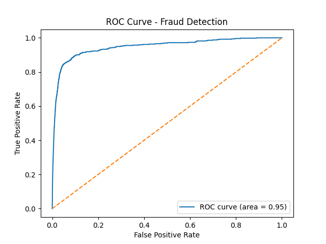
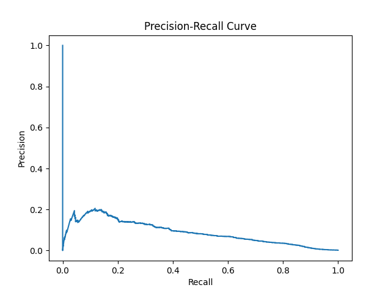
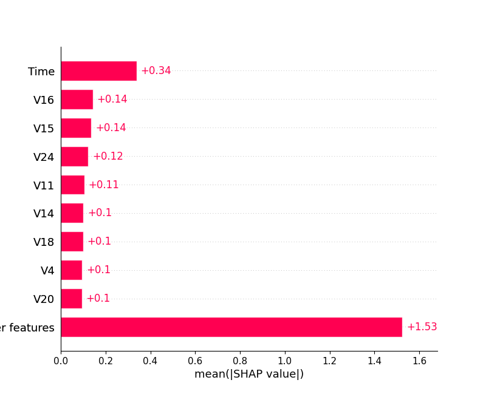
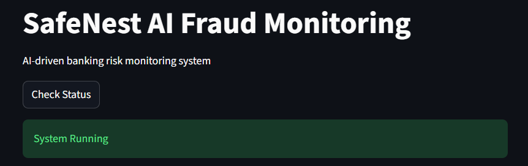

# 🏦 SafeNest — AI-Driven Multi-Agent Banking Security System

Designed as a **research-oriented AI system** combining anomaly detection, behavioral intelligence, and explainable AI for real-world fraud detection.

---

# Key Highlights

* 🧠 Multi-Agent AI Architecture
* 📊 Behavioral Risk Modeling
* ⚡ Real-time Risk Scoring Engine
* 🔍 Explainable AI (SHAP)
* 📈 ROC-AUC ≈ **0.95**
* 🌐 End-to-End System (API + Dashboard + DB)

---

# 💡 Why SafeNest is Unique

* Combines **anomaly detection + behavioral profiling**
* Uses **multi-agent architecture**, not a single ML model
* Integrates **Explainable AI (SHAP)** for transparency
* Implements **continuous risk scoring (0–100)** like real banking systems

---

# 📊 Key Results

* ROC-AUC Score: **~0.95**
* Behavioral modeling improves fraud detection performance
* Isolation Forest outperforms LOF & One-Class SVM

---

# 🏗️ System Architecture

The SafeNest system follows a **multi-agent event-driven pipeline** for real-time fraud detection.



Transaction → Fraud Detection → Behavioral Profiling → Risk Scoring → Decision → Database → Dashboard

---

# 🧠 Core Components

| Component                  | Role                              |
| -------------------------- | --------------------------------- |
| Fraud Detection Agent      | Detects anomalies using ML models |
| Behavioral Profiling Agent | Builds user behavior baseline     |
| Coordinator Agent          | Computes risk score & decision    |
| Compliance Agent           | Logs events in database           |
| API Layer                  | Backend service (FastAPI)         |
| Dashboard                  | Real-time monitoring UI           |

---

# ⚡ Risk Scoring Model

SafeNest uses a **continuous risk scoring system** instead of binary decisions.

### 📌 Formula

```math
Risk = (Anomaly Score × 50) + (Behavior Deviation × 30)
```

### 📊 Decision Thresholds

| Risk Score | Decision |
| ---------- | -------- |
| 0 – 30     | ALLOW    |
| 30 – 70    | ALERT    |
| 70+        | BLOCK    |

👉 Mimics real-world banking risk engines.

---

# 📈 Research Experiments

## 🔹 Model Comparison

| Model            | Precision | Recall | F1 Score |
| ---------------- | --------- | ------ | -------- |
| Isolation Forest | 0.09      | 0.125  | 0.105    |
| LOF              | 0.00      | 0.00   | 0.00     |
| One-Class SVM    | 0.00      | 0.00   | 0.00     |

👉 Isolation Forest performs best for imbalanced fraud detection.

---

## 📈 ROC Curve



AUC ≈ **0.95** → strong fraud detection capability.

---

## 📊 Precision-Recall Curve



Highlights precision-recall trade-off for imbalanced datasets.

---

## 🔍 Explainable AI (SHAP)



Top influencing features:

| Feature       | Insight                       |
| ------------- | ----------------------------- |
| Time          | Temporal transaction patterns |
| V18, V16, V24 | Latent fraud signals          |
| Amount        | Transaction anomaly           |

---

## 🔹 Behavioral vs ML Experiment

| Approach        | Detection |
| --------------- | --------- |
| ML Only         | Low       |
| ML + Behavioral | High      |

👉 Behavioral intelligence improves fraud detection.

---

# 💻 System Demo



* Real-time transaction monitoring
* Risk score visualization
* Decision tracking

---

# ⚙️ Tech Stack

| Layer          | Tools                    |
| -------------- | ------------------------ |
| Language       | Python                   |
| ML             | scikit-learn, TensorFlow |
| Explainability | SHAP                     |
| Backend        | FastAPI                  |
| UI             | Streamlit                |
| Database       | SQLite                   |

---

# 📥 Dataset

This project uses the Credit Card Fraud Detection dataset.

Download it from:
https://www.kaggle.com/datasets/mlg-ulb/creditcardfraud

Place the file in:
dataset/creditcard.csv

---

# 📂 Project Structure

```
SafeNest
│
├── agents
├── api
├── dashboard
├── database
├── models
├── utils
│
├── experiments
├── plots
├── results
├── assets
│
└── main.py
```

---
# 🔧 Setup Environment

```bash
# create virtual environment
python -m venv venv

# activate (Windows)
venv\Scripts\activate

# install dependencies
pip install -r requirements.txt
```

---

# 🚀 How to Run

```bash
python main.py
uvicorn api.app:app --reload
streamlit run dashboard/dashboard.py
```

---

# 🎯 Key Contributions

* Designed **multi-agent AI system for fraud detection**
* Integrated **behavioral + anomaly modeling**
* Built **risk scoring engine**
* Conducted **ML experiments (ROC, PR, SHAP)**
* Developed **end-to-end system (API + Dashboard)**

---

# 🧠 Research Insight

> Behavioral profiling significantly enhances anomaly detection performance in fraud systems.

---

# 👩‍💻 Author

**Shaik Hasna**
AI & Data Science Graduate
---
